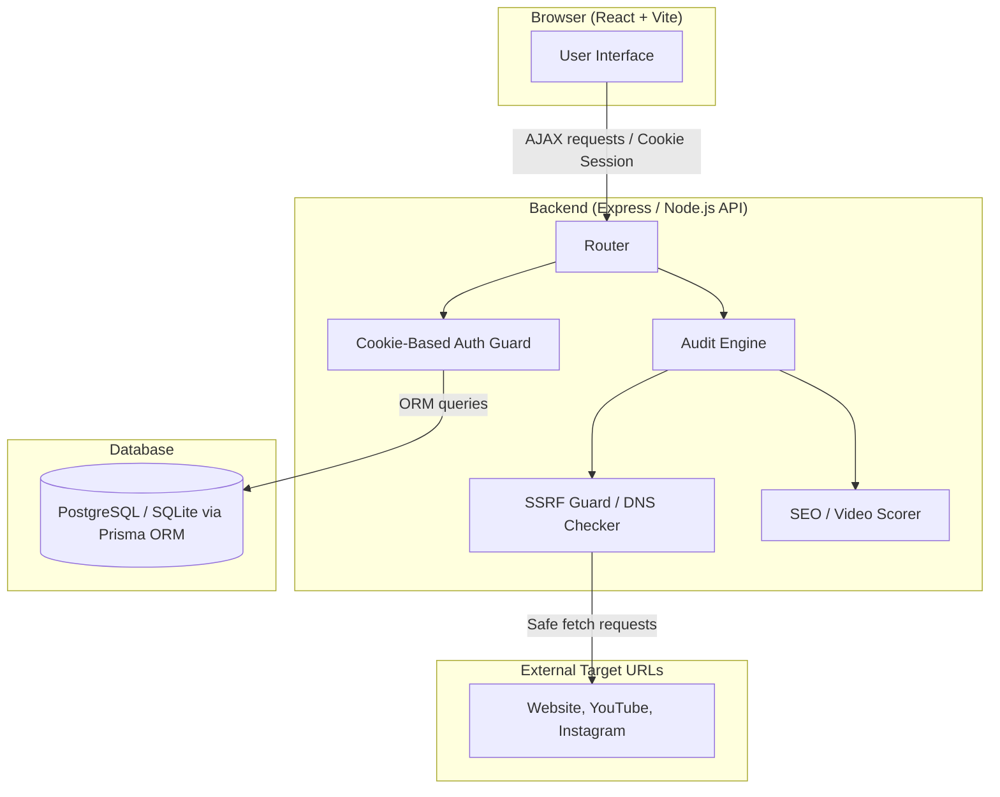

# Page Pulse — Master Website Audit & SEO Health Scanner

Page Pulse is a full-stack website auditing platform that takes a target URL, analyzes its HTTP health, load time, and core SEO metrics (title, meta description, H1 heading count, missing image alt text, word count), and calculates a composite health score with an assigned letter grade. Users can also log in to automatically persist audit logs and monitor site performance trends through visual analytics charts.

Mandatory Footer Text: `Built for Digital Heroes Training Task`

---

## Architecture Diagram



---

## Setup

### Prerequisites
- Node.js 18+
- PostgreSQL (local, or a hosted instance — Render/Supabase/Railway all work with Prisma)

### Backend
```bash
cd backend
cp .env.example .env        # fill in DATABASE_URL, JWT_SECRET, FRONTEND_URL
npm install
npx prisma migrate dev      # creates and applies migrations locally
npm run dev
```

### Frontend
```bash
cd frontend
cp .env.example .env        # set VITE_API_URL=http://localhost:3000
npm install
npm run dev
```

### Running tests
```bash
cd backend
npm test
```

---

## API Contract

### `POST /api/audit`
Runs an audit against a URL and returns a scored report. No authentication required.

**Request**
```json
{ "url": "https://example.com" }
```

**Response — 200**
```json
{
  "score": 62,
  "grade": "D",
  "breakdown": [
    { "check": "Title Tag", "points": 15, "status": "Passed" },
    { "check": "Meta Description", "points": 0, "status": "Failed", "suggestion": "Add a meta description under 160 characters." }
  ],
  "responseTime": 340,
  "missingAltImages": 3
}
```

**Response — video/streaming URLs (YouTube, Instagram)**
```json
{
  "mode": "video",
  "platform": "YouTube",
  "score": 70,
  "grade": "B",
  "breakdown": [
    { "check": "HTTPS Support", "points": 20, "status": "Passed" },
    { "check": "Reachable Link", "points": 20, "status": "Passed" },
    { "check": "Video Metadata", "points": 30, "status": "Passed" },
    { "check": "Response Time", "points": 0, "status": "Failed", "suggestion": "Optimize platform load speeds — ensure low latency connections." }
  ]
}
```

**Error responses**
| Status | Code | Meaning |
|---|---|---|
| 400 | `BLOCKED_HOST` | URL resolves to a private/loopback IP (SSRF guard) |
| 400 | `INVALID_URL` | Malformed or non-HTTP(S) URL |
| 408 / 504 | `TIMEOUT` | Target did not respond within the timeout window |
| 429 | `RATE_LIMITED` | Too many requests from this IP/account |

### `POST /api/auth/register`, `POST /api/auth/login`
Sets an httpOnly session cookie on success. No token is returned in the response body.

### `GET /api/history`
Requires auth (cookie). Returns saved audits for the logged-in user, each with a dynamically reconstructed `breakdown`.

### `DELETE /api/history/:id`
Requires auth. Deletes a saved audit.

---

## Three Design Decisions

**1. Cookie-based auth instead of returning a JWT in the response body.**
Storing a JWT in `localStorage` and reading it in JavaScript makes the token vulnerable to Cross-Site Scripting (XSS) attacks — any injected malicious script can read it. By setting an `httpOnly` session cookie from the backend, client-side scripts are entirely blocked from reading it, securing user sessions. The tradeoff is strict CORS configurations (`credentials: true` on both ends) and cookie management across domains, which is worth the significant security gains.

**2. Renaming API response fields without touching the database schema.**
Partway through the build, field names needed to change (`responseTimeMs` → `responseTime`, `imagesMissingAlt` → `missingAltImages`) to comply with the final spec. Renaming the actual database columns would have required creating migrations that rewrite historical columns, carrying potential downtime or data corruption risks. By keeping the existing database columns and mapping the fields at the controller/DTO layer before responding, the data storage tier remains stable and backward-compatible.

**3. Making the scoring breakdown a first-class, itemized part of the response instead of just returning a single number.**
Most audit tools return a single composite score and leave the detailed arithmetic calculations hidden. Returning every point deduction as a labeled `{ check, points, status, suggestion }` object allows the frontend to immediately render the interactive "Why this score?" drawer without additional API overhead. Furthermore, it enforces clear invariants (such as `sum(breakdownItems.points) === score`) which makes scoring logic highly testable.

---

## Known Limitations

- **Instagram content checks may return partial results.** Instagram blocks automated/non-browser requests to content pages, redirecting to a login wall. Rather than fake a result, the audit reports this honestly as a `Warning` with an explanatory suggestion, with partial credit for a valid, reachable link.
- **Video/streaming diagnostics currently cover YouTube and Instagram only** — the platform-detection config is intentionally structured to make adding more platforms (e.g. TikTok, Vimeo) a small addition, not a rewrite.
- **Video-mode audits are saved to history** when audited by authenticated users, preserving their score, platform, and check diagnostics logs over time.
